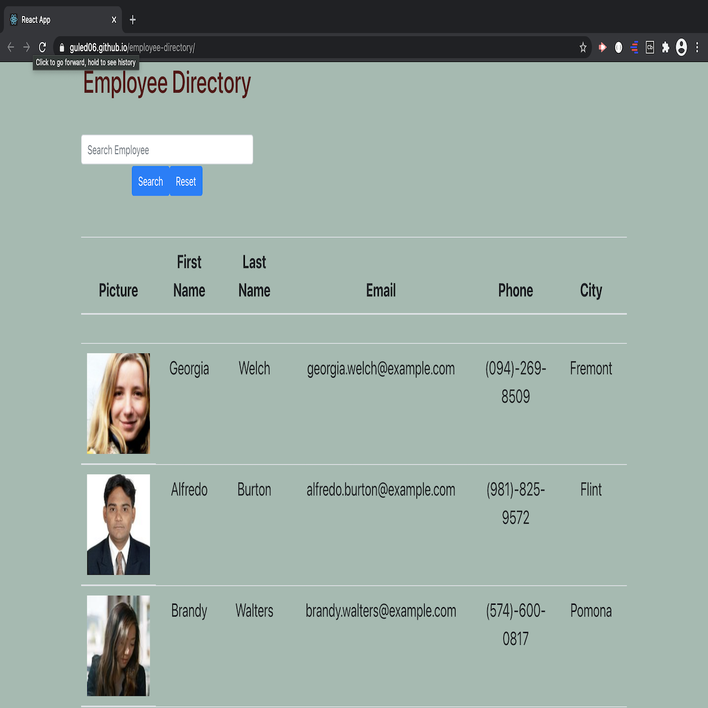

# Employee Directory

# Descripton:

For this assignment, I created an employee directory with React. I broke up my application's UI into components, manage component state, and respond to user events. As a user, the user will be able to view the entire employee directory at once so that the user can have quick access to their information.

An employee or manager would benefit greatly from being able to view non-sensitive data about other employees. It would be particularly helpful to be able to filter employees by name. Given a table of random users generated from the Random User API, when the user loads the page, a table of employees will render.

# Links:

GitHub Repository Link: https://github.com/Guled06/employee-directory

GitHub Pages Deployed Link: https://guled06.github.io/employee-directory/

# Screenshot Of Application:

